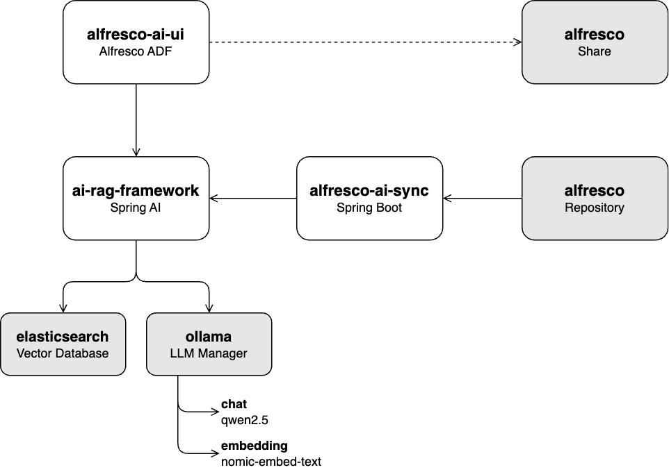

# Alfresco AI Framework

The **Alfresco AI Framework** is a framework designed to integrate AI capabilities into Alfresco, leveraging Java and Spring AI. It provides a set of tools and services to process, analyze, and enhance document content in Alfresco using AI and machine learning models.

## Key Features

- **AI-Driven Document Processing**: Use AI services to provide RAG chatting within the Alfresco repository.
- **Modular Architecture**: A Spring Boot-based architecture that allows flexible deployment and scaling.
- **Seamless Integration**: Easily integrate with the Alfresco content services to extend the repository's capabilities with AI.

## Getting Started

### Prerequisites

- **Java 17** (required for building and running the project)
- **Maven** (for building the project)
- **Docker** (optional, for containerized deployment)

### Architecture

### Projects

* **[ai-rag-framework](ai-rag-framework)**: A REST API that ingests documents into a Generative AI (GenAI) model and provides a Retrieval-Augmented Generation (RAG) chat service.
  - **Requirements**: A local Large Language Model (LLM) using Ollama and Elasticsearch as the vector database.

* **[alfresco-ai-sync](alfresco-ai-sync)**: A service that reads documents from the Alfresco Repository and ingests them into the vector database through the `ai-rag-framework` API.
  - **Requirements**: A running Alfresco Repository and the `ai-rag-framework` service.

* **[alfresco-ai-ui](alfresco-ai-ui)**: A user interface for interacting with the `ai-rag-framework` chat service.
  - **Requirements**: The `ai-rag-framework` service must be running.

## License

This project is licensed under the Apache License 2.0 - see the [LICENSE](LICENSE) file for details.

## Acknowledgments

Special thanks to the Alfresco and Hyland teams for their continued support and contributions to open-source projects in the content management and AI spaces.