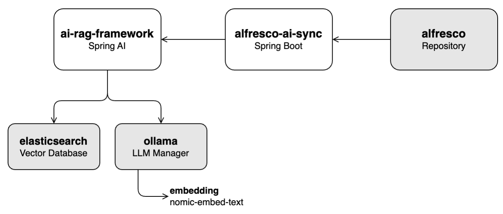

# Alfresco AI Framework  

  

The **Alfresco AI Framework** is a robust framework designed to integrate AI capabilities into Alfresco, leveraging Java and [Spring AI](https://spring.io/projects/spring-ai). It provides a suite of tools and services to process, analyze, and enhance document content in Alfresco using AI and machine learning models.  

> **Note**: This project uses the Spring AI SNAPSHOT version, as a final RELEASE is not yet available.  

## Key Features  

- **AI-Driven Document Processing**: Enable Retrieval-Augmented Generation (RAG) chat functionality within the Alfresco repository.  
- **Modular Architecture**: Built on a Spring Boot-based architecture, offering flexibility in deployment and scalability.  
- **Seamless Integration**: Easily extend Alfresco Content Services with AI capabilities.  

## Getting Started  

### Prerequisites  

- **Java 17**: Required for building and running the services  
- **Maven**: For building the backend services  
- **Angular 18**: For developing and running the UI  
- **Node.js 18**: Required for building the UI  
- **Docker**: For containerized deployment  

### Architecture  

  

## Projects  

- **[ai-rag-framework](ai-rag-framework)**:  
  A REST API built on top of [Spring AI](https://spring.io/projects/spring-ai) for ingesting documents into a Generative AI (GenAI) model and providing a Retrieval-Augmented Generation (RAG) chat service.
  - **Requirements**:  
    - A local Large Language Model (LLM) powered by Ollama  
    - Elasticsearch as the vector database  

- **[alfresco-ai-sync](alfresco-ai-sync)**:  
  A service built on top of [Alfresco Java SDK](https://github.com/Alfresco/alfresco-java-sdk) that retrieves documents from the Alfresco Repository and ingests them into the vector database through the `ai-rag-framework` API.  
  - **Requirements**:
    - A running Alfresco Repository  
    - The `ai-rag-framework` service  

- **[alfresco-ai-ui](alfresco-ai-ui)**:  
  A user interface built on top of [Alfresco ADF](https://github.com/Alfresco/alfresco-ng2-components) for interacting with the RAG chat service provided by `ai-rag-framework`.  
  - **Requirements**:  
    - The `ai-rag-framework` service must be running

- **[alfresco-docker](alfresco-docker)**:
  Container-oriented Alfresco Community 23.3 deployment     

## Laboratories

Exploring the features of the project can be done by following this series of tutorials, which cover the processes of data ingestion, chat integration, and the overall operation of the project.

- **Lab 1: Ingestion Pipeline**

- **Lab 2: Chat Functionality**  

- **Lab 3: Running All Components Together**  

## License  

This project is licensed under the Apache License 2.0. See the [LICENSE](LICENSE) file for details.  

## Acknowledgments  

Special thanks to the Alfresco and Hyland teams for their continuous support and contributions to open-source initiatives in the content management and AI domains.