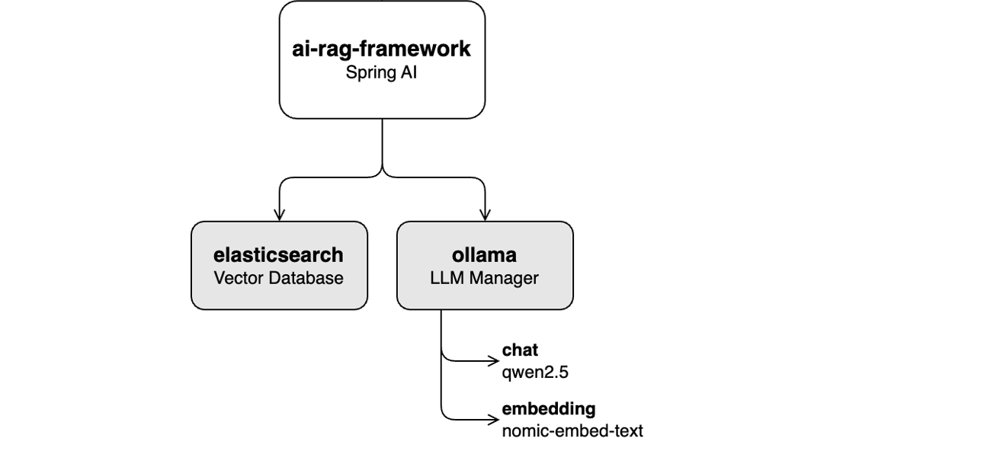

# Lab 2: Chat Functionality



In this lab, you will learn how to search for content related to a prompt in the **Vector Database** (Elasticsearch) and how to construct an answer by passing this context to the **LLM** `qwen2.5` via Ollama.

## Components

- **ai-rag-framework** exposes a REST API for chatting, retrieves context information from the **Vector Database** (Elasticsearch), and uses [Ollama](https://ollama.com/) to access the `qwen-2.5` LLM, which generates answers to user prompts.

## Configuration Files

- Ollama and Elasticsearch settings can be configured in the [application.yml](https://github.com/aborroy/alfresco-ai-framework/blob/main/ai-rag-framework/src/main/resources/application.yml#L13) file of the **ai-rag-framework** application.  

## Obtaining answers to prompts using the REST API

It is required to complete [Lab 1: Ingestion Pipeline](docs/lab1-ingestion.md) before proceeding with this lab to ensure that the **Vector Database** is already populated.

1. **Verify ollama is running** or start the program

   ```sh
   ollama -v
   ```

2. **Start AI RAG framework** by running the following command:

    ```sh
    cd ai-rag-framework/deployment
    docker compose up --build --force-recreate
    ```

3. Use [httpie](https://httpie.io/cli) `curl` or equivalent for making API calls

   Obtaining an answer for a prompt can be achieved by invoking the AI RAG framework `http://localhost:9999/chat` endpoint:

```bash
curl --request POST \
  --url http://localhost:9999/chat \
  --header 'Content-Type: text/plain; charset=utf-8' \
  --data 'Explain how Caesar'\''s cipher works'
```

   The results include the answer, the documents used for context, and the LLM utilized:

```json
{
  "answer": "Caesar's cipher is a substitution cipher that encrypts text by shifting each letter by a fixed number of positions in the alphabet.",
  "documentMetadata": [
    {
      "fileName": "cryptography-2.pdf",
      "documentId": "2debeaaf-9424-455a-abea-af9424b55a89",
      "source": "cryptography-2.pdf",
      "folderId": "5730a944-248d-43cf-b0a9-44248d23cfec",
      "distance": 0.7058792
    },
    {
      "fileName": "cryptography-0.pdf",
      "documentId": "536fe0b0-cb3f-43f4-afe0-b0cb3f43f42c",
      "source": "cryptography-0.pdf",
      "folderId": "5730a944-248d-43cf-b0a9-44248d23cfec",
      "distance": 0.6827631
    },
    {
      "fileName": "cryptography-3.pdf",
      "documentId": "b4470b47-f550-41ef-870b-47f55081ef46",
      "source": "cryptography-3.pdf",
      "folderId": "5730a944-248d-43cf-b0a9-44248d23cfec",
      "distance": 0.6497326
    }
  ]
}
```

Every answer includes the content of the document, including structured fields:

- **`answer`:** The answer to the prompt.
- **`documentMetadata`:** List of documents and metadata used to provide context to the LLM
- **`fileName`:** Name of the original file (`file.pdf`) in Alfresco Repository.
- **`documentId`:** A unique identifier for this document in Alfresco Repository.
- **`source`:** Name of the original file (`file.pdf`) in Alfresco Repository.
- **`folderId`:** ID of the sync folder in the Alfresco Repository where the document resides. 
- **`distance`:** Relevancy of the document measured in distance to the original prompt.


**Spring AI for chatting**

The service **ai-rag-framework** is providing the chatting service by using following pieces of code:

Configuration for Vector Database (elasticsearch), ollama, embedding model and LLM for chatting is defined in [application.yml](https://github.com/aborroy/alfresco-ai-framework/blob/main/ai-rag-framework/src/main/resources/application.yml)

```yaml
  elasticsearch:
    uris: http://localhost:9200

  ai:
    ollama:
      base-url: http://localhost:11434
      init:
        pull-model-strategy: when_missing
      chat:
        options:
          model: qwen2.5
          temperature: 0.0
      embedding:
        options:
          model: nomic-embed-text          
    vectorstore:
      elasticsearch:
        initialize-schema: true
        index-name: alfresco-ai-document-index
        dimensions: 768
```

The prompt is processed using the [ChatClient](https://github.com/spring-projects/spring-ai/blob/main/spring-ai-core/src/main/java/org/springframework/ai/chat/client/ChatClient.java) class to process the query. The [QuestionAnswerAdvisor](https://github.com/spring-projects/spring-ai/blob/main/spring-ai-core/src/main/java/org/springframework/ai/chat/client/advisor/QuestionAnswerAdvisor.java) class provides the additional context searching the `DEFAULT_TOP_K` most relevant results from the `vectorStore` using the `nomic-embed-text` embedding. These context is used together with the `qwen2.5` LLM to build the chat response.


```java
// Configuring advisors to enhance the response quality
ChatResponse response = chatClient.prompt()
        .user(query)
        .advisors(new QuestionAnswerAdvisor(vectorStore, SearchRequest.defaults().withTopK(DEFAULT_TOP_K)))
        .call()
        .chatResponse();

```        