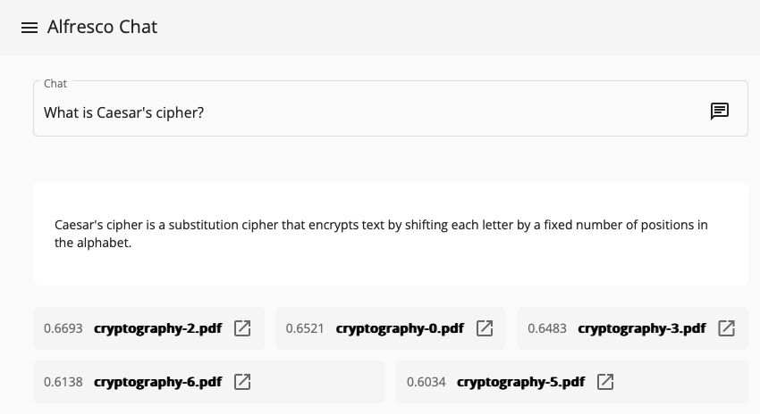

# Lab 3: Running All Components Together


In this lab, you'll integrate all the components (ingestion and chat functionality) with a live Alfresco Repository. The system will automatically update the **Vector Database** whenever changes occur in the repository, eliminating the need for manual intervention. Additionally, a user interface will be provided for interacting with the chat service.

## Components

- **Alfresco** acts as the **Knowledge Base**, storing documents within folders that have the `cm:syndication` aspect (1)
- **alfresco-ai-sync** listens to changes in sync folder from the Alfresco Repository and updates the content to the **Vector Database** through the AI RAG Framework REST API (2)
- **ai-rag-framework** exposes the REST API for ingestion and utilizes [Ollama](https://ollama.com/) to access the `nomic-embed-text` embedding model and the `qwen-2.5` LLM (3)
- **alfresco-ai-ui** provides a UI, built on top of [ADF](https://www.alfresco.com/abn/adf/docs/), for interacting with the chat service (4)

## Configuration Files

- (1) The aspect and properties to be used can be configured in the [application.properties](https://github.com/aborroy/alfresco-ai-framework/blob/main/alfresco-ai-sync/src/main/resources/application.properties#L18) file of the **alfresco-ai-sync** application.  
- (2) Alfresco credentials, protocol, host, and port can be configured in the [application.properties](https://github.com/aborroy/alfresco-ai-framework/blob/main/alfresco-ai-sync/src/main/resources/application.properties#L25) file of the **alfresco-ai-sync** application.  
- (3) Ollama and Elasticsearch settings can be configured in the [application.yml](https://github.com/aborroy/alfresco-ai-framework/blob/main/ai-rag-framework/src/main/resources/application.yml#L13) file of the **ai-rag-framework** application.  
- (4) Chat service and Alfresco Share servers can be configured using [environment variables](https://github.com/aborroy/alfresco-ai-framework/blob/main/compose.yaml#L20)

## Step 1: Use the UI to get answers

It is required to complete [Lab 1: Ingestion Pipeline](docs/lab1-ingestion.md) before proceeding with this lab to ensure that the **Vector Database** is already populated.

1. **Start the stack** by running the following command:

   ```sh
   docker compose up --build --force-recreate
   ```

2. After a while, all the services will be up & ready

   ```sh
   docker ps

   CONTAINER ID   IMAGE                                                   PORTS
   92db86206d73   alfresco-ai-framework                                   0.0.0.0:9999->9999/tcp
   f27e5fb2079a   kibana:8.15.3                                           0.0.0.0:5601->5601/tcp                     
   7a8acc029270   elasticsearch:8.15.3                                    9200/tcp, 9300/tcp
   6d6c6e50967c   alfresco-ai-sync                                        
   ba7f3cf0fd39   alfresco-ai-ui                                          0.0.0.0:80->80/tcp
   de55e97b01f8   alfresco/alfresco-acs-nginx:3.4.2                       80/tcp, 0.0.0.0:8080->8080/tcp
   c309d41d8878   alfresco/alfresco-search-services:2.0.12                8983/tcp, 10001/tcp
   db1fba8aecd3   alfresco/alfresco-share:23.3.0                          8000/tcp, 8080/tcp
   e87a98d1e421   alfresco/alfresco-content-repository-community:23.3.0   8000/tcp, 8080/tcp, 10001/tcp
   cc9b9518fd68   alfresco/alfresco-transform-core-aio:5.1.4              8090/tcp
   3a07a3d2c698   postgres:14.4                                           5432/tcp
   a3c4c59c4ce0   alfresco/alfresco-activemq:5.18-jre17-rockylinux8       5672/tcp, 8161/tcp, 61613/tcp, 61616/tcp
   ```

3. Use the UI, available in http://localhost, to get answers to prompts



>> Source document details can be accessed by clicking the icon in the list below the answer. This will open the view page in Alfresco Share application.

## Step 2: Update the Knowledge Base

1. **Log into Alfresco Share** using the default credentials:

   Username: `admin`  
   Password: `admin`  
   Access Alfresco Share at: [http://localhost:8080/share](http://localhost:8080/share)

2. **Access to the "Knowledge Base" folder** and **add some documents** to the folder `RAG` within the `Knowledge Base` folder.

   > **Knowledge Base** is being updated with the changes by **alfresco-ai-sync** service

3. Verify the Vector Database Population

Access Kibana Developer Tools at http://localhost:5601/app/dev_tools#/console and type following request:

```
GET /alfresco-ai-document-index/_search
{
  "hits": {
    "total": {
      "value": 7,
      "relation": "eq"
    },
    "hits": [
      { ... }
      ...
    ]
  }
}
``` 

> Added document should be indexed and ready to be used by the **ai-rag-framework** service
